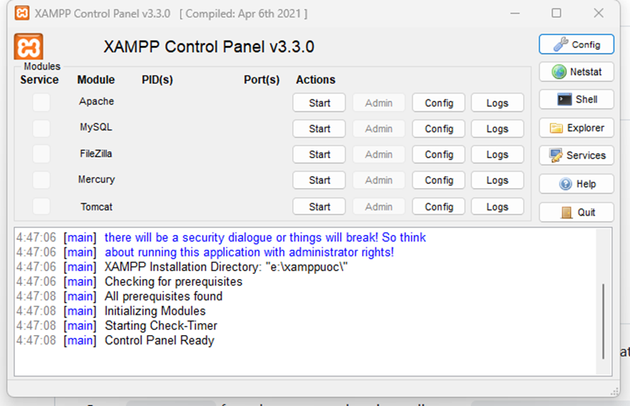
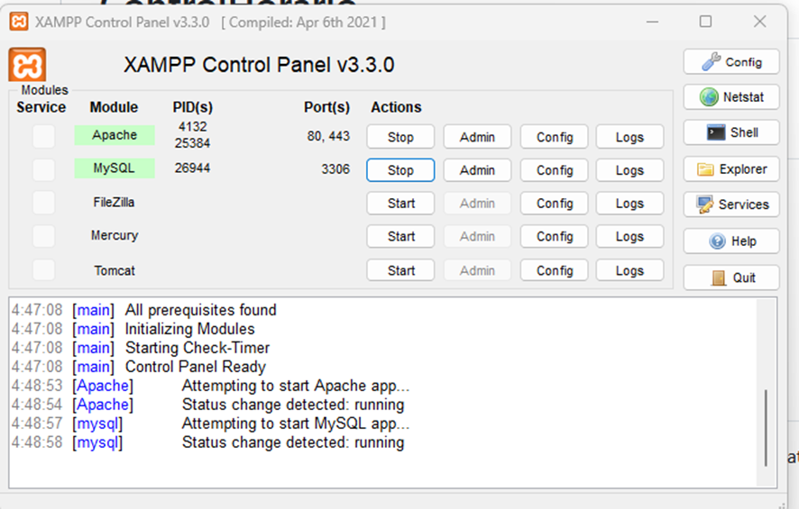
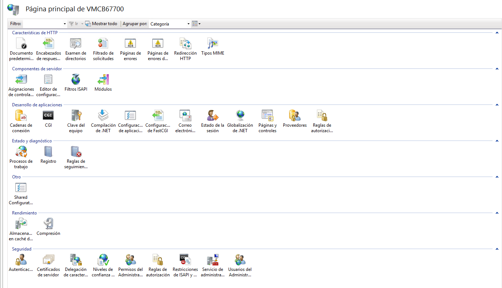
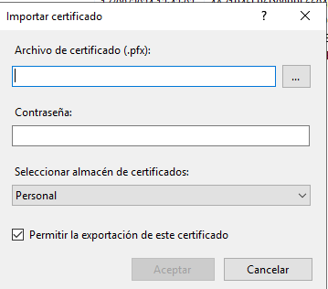
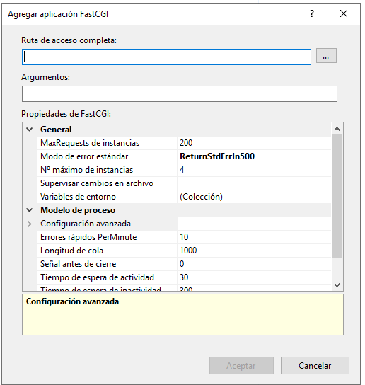
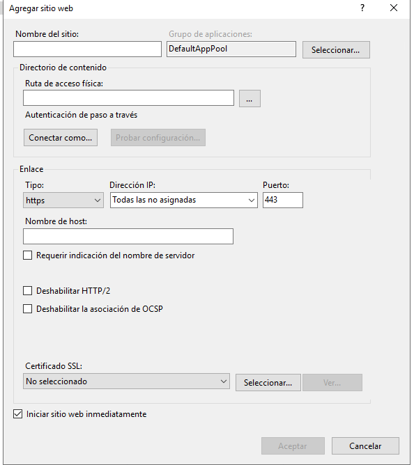
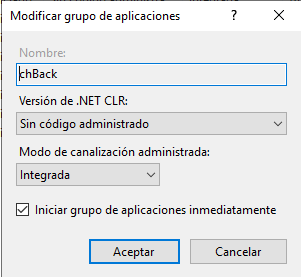
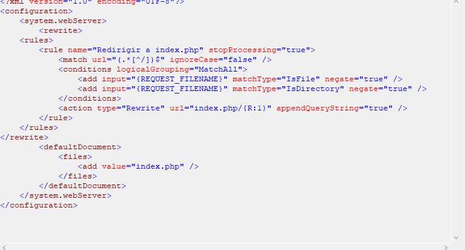

## About Laravel

Laravel is a web application framework with expressive, elegant syntax. We believe development must be an enjoyable and creative experience to be truly fulfilling. Laravel takes the pain out of development by easing common tasks used in many web projects, such as:

- [Simple, fast routing engine](https://laravel.com/docs/routing).
- [Powerful dependency injection container](https://laravel.com/docs/container).
- Multiple back-ends for [session](https://laravel.com/docs/session) and [cache](https://laravel.com/docs/cache) storage.
- Expressive, intuitive [database ORM](https://laravel.com/docs/eloquent).
- Database agnostic [schema migrations](https://laravel.com/docs/migrations).
- [Robust background job processing](https://laravel.com/docs/queues).
- [Real-time event broadcasting](https://laravel.com/docs/broadcasting).

Laravel is accessible, powerful, and provides tools required for large, robust applications.

## Learning Laravel

Laravel has the most extensive and thorough [documentation](https://laravel.com/docs) and video tutorial library of all modern web application frameworks, making it a breeze to get started with the framework.

You may also try the [Laravel Bootcamp](https://bootcamp.laravel.com), where you will be guided through building a modern Laravel application from scratch.

If you don't feel like reading, [Laracasts](https://laracasts.com) can help. Laracasts contains thousands of video tutorials on a range of topics including Laravel, modern PHP, unit testing, and JavaScript. Boost your skills by digging into our comprehensive video library.

## Laravel Sponsors

We would like to extend our thanks to the following sponsors for funding Laravel development. If you are interested in becoming a sponsor, please visit the [Laravel Partners program](https://partners.laravel.com).

### Premium Partners

- **[Vehikl](https://vehikl.com/)**
- **[Tighten Co.](https://tighten.co)**
- **[WebReinvent](https://webreinvent.com/)**
- **[Kirschbaum Development Group](https://kirschbaumdevelopment.com)**
- **[64 Robots](https://64robots.com)**
- **[Curotec](https://www.curotec.com/services/technologies/laravel/)**
- **[Cyber-Duck](https://cyber-duck.co.uk)**
- **[DevSquad](https://devsquad.com/hire-laravel-developers)**
- **[Jump24](https://jump24.co.uk)**
- **[Redberry](https://redberry.international/laravel/)**
- **[Active Logic](https://activelogic.com)**
- **[byte5](https://byte5.de)**
- **[OP.GG](https://op.gg)**

## Contributing

Thank you for considering contributing to the Laravel framework! The contribution guide can be found in the [Laravel documentation](https://laravel.com/docs/contributions).

## Code of Conduct

In order to ensure that the Laravel community is welcoming to all, please review and abide by the [Code of Conduct](https://laravel.com/docs/contributions#code-of-conduct).

## Security Vulnerabilities

If you discover a security vulnerability within Laravel, please send an e-mail to Taylor Otwell via [taylor@laravel.com](mailto:taylor@laravel.com). All security vulnerabilities will be promptly addressed.

## License

The Laravel framework is open-sourced software licensed under the [MIT license](https://opensource.org/licenses/MIT).

# Para poder trabajar con PHP y XAMPP

## Xamp:

Para la instalación y uso del back, primero debemos de tener instalado [XAMPP](https://www.apachefriends.org/es/index.html) (Paquete de software libre que incluye MariaDB, PHP y Perl).

## Composer:

Para poder realizar la instalación de la aplicación una vez descargada del git, nos hará falta tener instalado [composer](https://getcomposer.org/download/) para poder hacer la instalación de los componentes.

## Instalación y Ejecución:

Una vez instalado el XAMPP, en su panel de control

Activaremos tanto del Apache como el MySQL, quedándonos como muestra la siguiente imagen:

Para instalar, deberemos de ir a la carpeta de XAMPP a la carpeta htdocs y descargar la aplicación del git, se puede realizar a través de:

Si lo hacemos por SSH: git@github.com:dsansnuoc/controlHorario_back.git

Si lo hacemos por HTTPS: https://github.com/dsansnuoc/controlHorario_back.git

Una vez descargado, en el directorio donde se haya instalado, ejecutamos ‘composer install’, el cual nos instalará todos los componentes y versiones usados.

Una vez haya terminado ejecutaremos `hp artisan migrate`, el cual nos creará las bases de datos con los datos iniciales mínimos que son el superadministrador y los roles.

## Instalar Server Proudcción (IIS)

Para poder instalar en proucción, en este caso en un IIS

### Configurar Servidor Producción:

## ## Cetificado:

En el nombre del servidor hacemos doble click y nos aparecen las características:

Hacemos doble click en el apartado de "Certificados del Servidor"

En el menú de la derecha, realizamos "importar", y nos aparece la ventana par importar un certificado pfx

Buscamos el certificado.
Indicamos la contraseña
Y Aceptamos.

Nos deberá de aparecen en el Listado de Certificados de Servidor.

## ## Configuración FastCGI

Primero deberemos tener instalado un XAMPP o PHP para que funcione la aplicación.

En el nombre del servidor hacemos doble click y nos aparecen las características:

Hacemos doble click en el apartado de "Configuración de FastCGI"

En el menú de la derecha, "Agregar Aplicación"

Le indicamos nuestra ruta del fichero `php-cgi.exe`

## ## Creación carpeta principal en el Servidor:

El nombre de la carpeta, puede ser por ejemplo: ControlHorario

Dentro de esta carpeta, se creará la carpera de Front, donde irá la aplicación.

Copiaremos de nuestra carpeta del proyectro  `dist/` al servidor.

## ## ## Configuración Site:

En el menú de la izquierda en en el apartado "Sites" (Sitios), realizamos botón Derecho "Agregar sitio Web"

Indicamos el nombre del sitio.
La Ruta Física.
Enlace https, indicando el puerto, generalmente es el 443
Nombre del host. (Url que vamos a usar para poder acceder).

Elegimos el certificado.

Aceptamos y hos habrá creado el sitio.

## ## ## Configuración Grupo de Aplicaciones

En el menú izquierdo Grupo de aplicaciones, buscamos el grupo que nos acaba de crear automatiamente, es el nombre del Site.

Le hacemos botón derecho Configuración básica.

En el apartado Versión de .NET CLR, le indicamos "Sin código administrado".

En el menú de la izquierda, hacemos click en el site, elegimos la opción "Editor de configuración":

El fichero web.config ha de contener para el buen funcionamiento:

En el apartado "Documento Predeterminado", añadimos `index.php`

Dentro de la carpeta raiz tenemos el ficchero `.env` debemos indicar:

Para la conexión a la base de datos principal:

DB_CONNECTION=mysql
DB_HOST=127.0.0.1
DB_PORT=3306
DB_DATABASE=chmaster
DB_USERNAME=root
DB_PASSWORD=

Para la conexión de cada una de las empresas / clientes:

DB_CONNECTION_EMP1=mysql_empresa1
DB_HOST_EMP1=127.0.0.1
DB_PORT_EMP1=3306
DB_DATABASE_EMP1=fichaje_emp_1
DB_USERNAME_EMP1=root
DB_PASSWORD_EMP1=

_EMP1 --> Serán sucesivos.

_empresa1 --> será sucesivos.

_emp_1 --> Será sucesivos.

## ## Base de Datos

Hay que tener instalado MySQL, y recuperamos los backups de las bases de datos.

